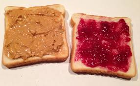

# Welcome to AI App Basics

By now all you undoubtedly have used an AI powered app in all its glory.
If so you've experienced something akin to this Michelin starred meal,
a carefully choreographed outcome,
created by experts who have acess to a top notch kitchen.

This is not what we're doing today.
We'll be making this.

How does thie relate to AI apps?
The very polished apps you see online are the result of an intensive process,
coordinated through model developers, 
application experts,
and skilled infrastructure engineers.

We're starting with the basics.
After all even the experts had to start somewhere,
and if you're an American child starting cooking peanut butter sandwiches is probably where you started.

And if this is you're starting AI Application developemnt,
this is your peanut butter sandwich equivalent.

# American or Australian Football Detector
We'll be designing an application that can identify if a piece of text talking about an American Football team or an Australian one.
To get our app up and running we'll be following three basic steps

## Evaluation
* Define eval metrics for quality
* Build a basic eval loop to baseline performance, even has we make changes.

## Optimization
* Expose lower level inference details 
* Try different settings measure
  * Quality Changes
  * Speedup
* Make decisions balancing these two factors

## Iteration
* Pick another model and rerun evals
* Make decision if cost/compute expense tradeoff is worth it

# And that's it
It really is that simple at a high level.
The complexity comes at the challenges you end up facing within each part of this.
But enough talk,
let's get started.